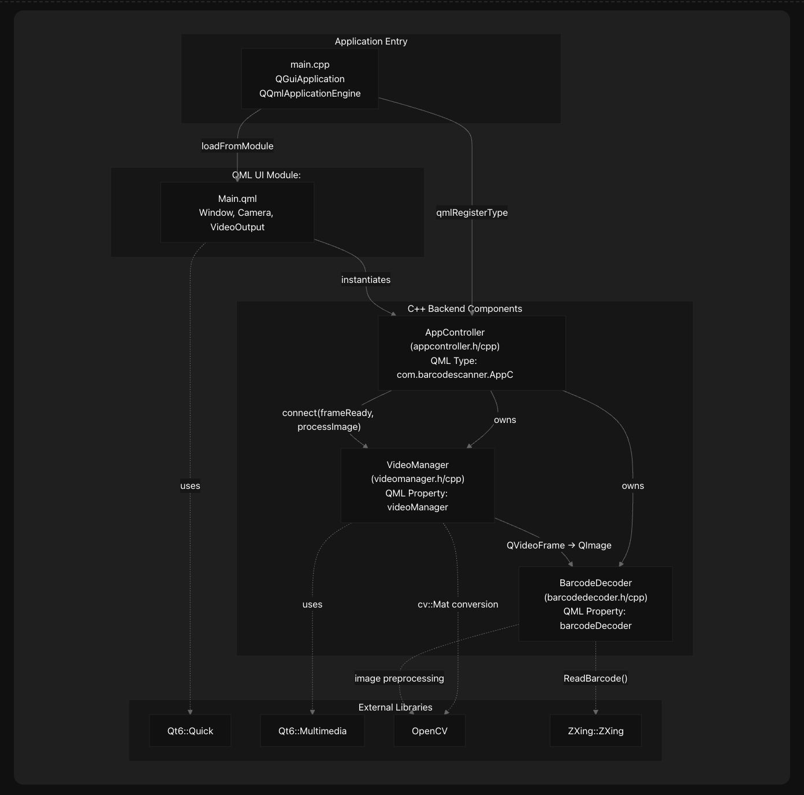

# ZXing based Barcode Decoder

Barcode-Decoder is a real-time barcode scanning application built with Qt6, OpenCV, and ZXing-Cpp. The application captures live video from a camera, processes video frames to detect and decode barcodes, and displays the decoded results to the user through a graphical interface.

## The system implements a three-tier architecture:

* **QML UI Layer:** Provides camera view and result display
* **C++ Bridge Layer:** Coordinates video capture and barcode processing
* **Processing Layer:** Handles video frame conversion and barcode detection

| Key Features | Feature Description | Implementation |
| -------- | ------- | ------- |
| Real-time Camera Feed | Live video capture and display from device camera | Qt6 Multimedia Camera and VideoOutput components |
| Automatic Barcode Detection | Continuous scanning of video frames for barcodes | ZXing-Cpp library integration in BarcodeDecoder |
| Multi-format Support | Detects various barcode formats (QR, EAN, UPC, etc.) | ZXing-Cpp ReadBarcode() with default format configuration |
| Image Preprocessing | Optimizes frames for better detection accuracy | OpenCV operations: grayscale conversion, resizing, histogram equalization |
| Frame Optimization | Reduces CPU usage by processing selective frames | Frame dropping strategy (2-out-of-3) in VideoManager |
| Cross-platform | Runs on Windows, macOS, and Linux | Qt6 framework with platform-specific bundle support |

## System Architecture Overview
The following diagram shows the main components of the system and their relationships using actual code entities:

